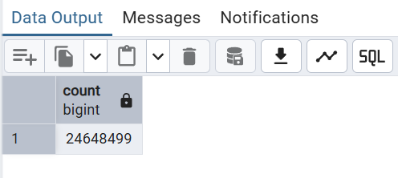
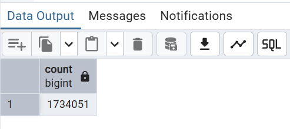
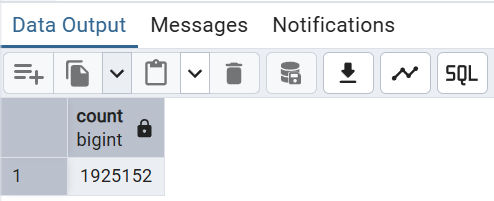

# Week 2: Workflow Orchestration
## Overview
This module is part of the **Data Engineering Zoomcamp** and focuses on the principles and practices of workflow orchestration. It covers the design and implementation of robust, automated data pipelines using modern orchestration tools.

## Key Highlights

- **Infrastructure as Code**  
  Leverage YAML-based configurations to define and manage your workflows, ensuring consistency and ease of maintenance.

- **Automation with Kestra**  
  Utilize Kestra, an open-source orchestration platform, to automate the scheduling and management of ETL pipelines. This helps in efficiently handling task dependencies and executing workflows seamlessly.

- **Practical ETL Pipeline Construction**  
  Engage in hands-on exercises that guide you through building pipelines for data extraction, transformation, and loading. The module emphasizes real-world scenarios such as data cleaning, transformation, and scheduling.

- **Best Practices in Data Engineering**  
  Learn strategies to create scalable, reliable, and maintainable data workflows, preparing you to tackle the complexities of modern data environments.

This module not only introduces you to the theoretical aspects of workflow orchestration but also provides practical experience, ensuring you are well-equipped to implement these concepts in your data engineering projects.

For more details, visit the [GitHub repository](https://github.com/DataTalksClub/data-engineering-zoomcamp/tree/main/02-workflow-orchestration).

## Homework
### Question 1
Within the execution for Yellow Taxi data for the year 2020 and month 12: what is the uncompressed file size (i.e. the output file yellow_tripdata_2020-12.csv of the extract task)?
- **128.3 MB**
- 134.5 MB
- 364.7 MB
- 692.6 MB

### Question 2
What is the rendered value of the variable file when the inputs taxi is set to green, year is set to 2020, and month is set to 04 during execution?
- ```{{inputs.taxi}}_tripdata_{{inputs.year}}-{{inputs.month}}.csv```
- **```green_tripdata_2020-04.csv```**
- ```green_tripdata_04_2020.csv```
- ```green_tripdata_2020.csv```

### Question 3
How many rows are there for the Yellow Taxi data for all CSV files in the year 2020?
- 13,537.299
- **24,648,499**
- 18,324,219
- 29,430,127

```sql
SELECT COUNT(*)
FROM yellow_tripdata
WHERE filename LIKE '%2020%';
```
Result:


### Question 4
How many rows are there for the Green Taxi data for all CSV files in the year 2020?**

- 5,327**,301
- 936,199
- **1,734,051**
- 1,342,034

```sql
SELECT COUNT(*)
FROM green_tripdata
WHERE filename LIKE '%2020%';
```
Result:


### Question 5
How many rows are there for the Yellow Taxi data for the March 2021 CSV file?

- 1,428,092
- 706,911
- **1,925,152**
- 2,561,031

```sql
SELECT COUNT(*)
FROM yellow_tripdata
WHERE filename LIKE '%2021-03%'
```
Result:


### Question 6
How would you configure the timezone to New York in a Schedule trigger?

- Add a timezone property set to EST in the Schedule trigger configuration
- **Add a timezone property set to America/New_York in the Schedule trigger configuration**
- Add a timezone property set to UTC-5 in the Schedule trigger configuration
- Add a location property set to New_York in the Schedule trigger configuration